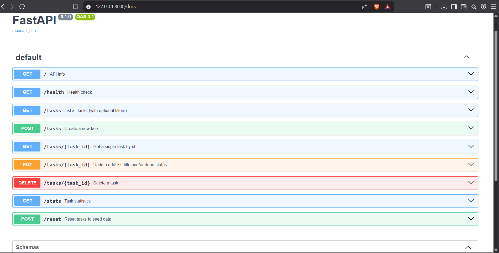

# CRUD API

A small in-memory CRUD API built with FastAPI, as part of the FlyRank Backend Track.

## Run it

\`\`\`bash
python3 -m venv venv
source venv/bin/activate
pip install -r requirements.txt
uvicorn main:app --reload --port 8000
\`\`\`

Then visit http://localhost:8000/docs for interactive Swagger UI.

## Endpoints

| Method | Path         | Description             | Success | Errors |
|--------|--------------|--------------------------|---------|--------|
| GET    | /            | API info                 | 200     | -      |
| GET    | /health      | Health check              | 200     | -      |
| GET    | /tasks       | List all tasks            | 200     | -      |
| GET    | /tasks/{id}  | Get one task              | 200     | 404    |
| POST   | /tasks       | Create a task              | 201     | 400    |
| PUT    | /tasks/{id}  | Update a task              | 200     | 400, 404 |
| DELETE | /tasks/{id}  | Delete a task              | 204     | 404    |

## Example

\`\`\`bash
$ curl -i -X POST http://localhost:8000/tasks -H "Content-Type: application/json" -d '{"title":"Buy milk"}'
HTTP/1.1 201 Created
...
{"id":4,"title":"Buy milk","done":false}
\`\`\`

## Swagger UI

## Notes

Data is stored in memory only — restarting the server clears all tasks. This is intentional; a real database is next week's topic.