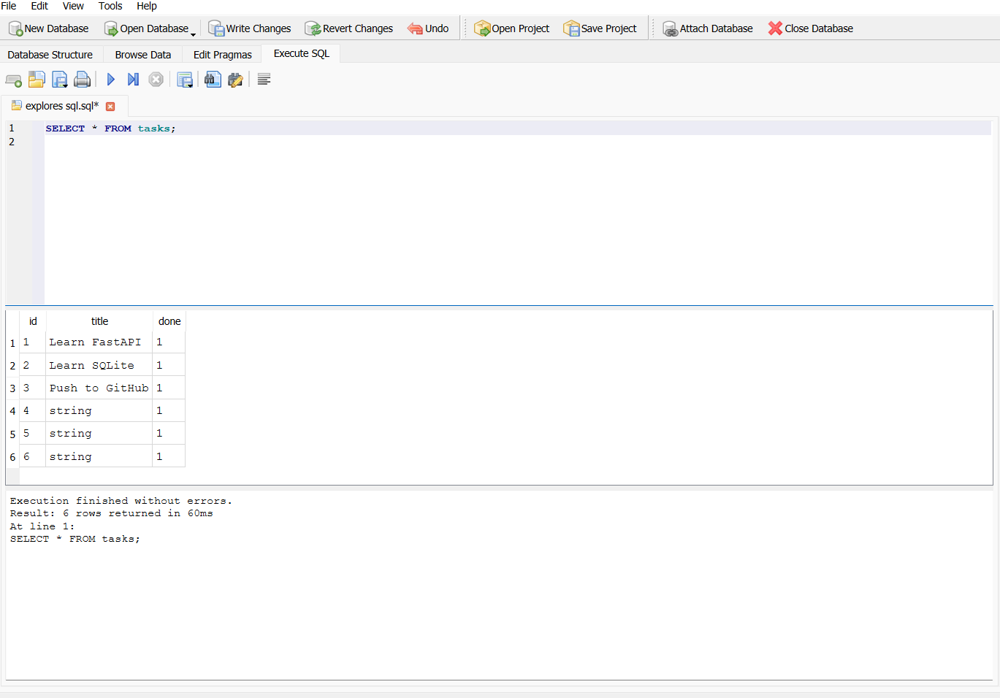

# CRUD API with SQLite

A RESTful CRUD API built with **FastAPI** and **SQLite** as part of the **FlyRank Backend Development Track – Week 3**.

This project extends the Week 2 CRUD API by replacing the in-memory task list with a persistent SQLite database.

## Features

- Create a task
- Get all tasks
- Get a task by ID
- Update a task
- Delete a task
- Persistent SQLite database
- Automatic database and table creation
- Automatic seeding of three sample tasks
- Interactive Swagger UI

---

## Tech Stack

- Python 3
- FastAPI
- Uvicorn
- SQLite (sqlite3)

---

## Why SQLite?

SQLite is a lightweight, serverless database that stores all data in a single file (`tasks.db`). It requires no additional setup and provides persistent storage, allowing task data to remain available even after restarting the server.

---

## Project Structure

```
CRUD-API/
│── main.py
│── database.py
│── tasks.db
│── requirements.txt
│── README.md
│── .gitignore
```

---

## Installation

Clone the repository

```bash
git clone https://github.com/Aaryansrinivas/CRUD-API.git
cd CRUD-API
```

Create a virtual environment

### Windows

```bash
python -m venv venv
venv\Scripts\activate
```

### Linux / macOS

```bash
python3 -m venv venv
source venv/bin/activate
```

Install dependencies

```bash
pip install -r requirements.txt
```

---

## Run the Application

```bash
uvicorn main:app --reload
```

Open the application:

- Swagger UI: http://127.0.0.1:8000/docs
- API: http://127.0.0.1:8000

---

## Database

The application automatically:

- Creates `tasks.db` if it does not exist.
- Creates the `tasks` table if it does not exist.
- Seeds three sample tasks only when the table is empty.
- Preserves all task data after server restarts.

> **Note:** `tasks.db` is listed in `.gitignore`, so every new clone creates its own database automatically.

---

## API Endpoints

| Method | Endpoint | Description |
|--------|----------|-------------|
| GET | `/` | API information |
| GET | `/health` | Health check |
| GET | `/tasks` | Get all tasks |
| GET | `/tasks/{id}` | Get a task by ID |
| POST | `/tasks` | Create a task |
| PUT | `/tasks/{id}` | Update a task |
| DELETE | `/tasks/{id}` | Delete a task |

---

## Example SQL Query

```sql
SELECT COUNT(*) FROM tasks;
```

**Result:**

Returns the total number of tasks currently stored in the SQLite database.

---

## DB Browser Screenshot


```markdown

```

---

## Sample Response

```json
[
  {
    "id": 1,
    "title": "Learn FastAPI",
    "done": false
  },
  {
    "id": 2,
    "title": "Learn SQLite",
    "done": false
  }
]
```

---

## Requirements

Generate the requirements file:

```bash
pip freeze > requirements.txt
```

Install dependencies:

```bash
pip install -r requirements.txt
```

---

## Author

**Aaryan Srinivas**

GitHub: https://github.com/Aaryansrinivas
